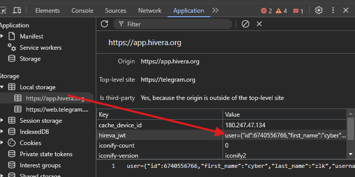

# HIVERA AUTO BOT
A decentralized network power by @ton_blockchain, backed by @Ton_Incubator. Contribute to powering AI innovation worldwide. [https://t.me/Hiverabot](https://t.me/Hiverabot/app?startapp=275bd2bae)

## Features

- **Auto Mines Hivera Tokens**
- **Support Multi Accounts**
- **Support proxy**: fill your proxy in `proxies.txt` format `http://user:pass@ip:port`

## Requirements

- **Node.js**: Ensure you have Node.js installed.
- **npm**: Ensure you have npm installed.
- **Hivera Jwt**: follow instructions below to get
- **Open MiniApp HiveraBot** : [https://t.me/Hiverabot](https://t.me/Hiverabot/app?startapp=275bd2bae)
- inspect or just click F12 and find application
- in Local Storage find Hivera_jwt and copy it.
    


## Setup

1. Clone this repository:
   ```bash
   git clone https://github.com/FlexRex69/Hivera-Bot.git
   cd Hivera-Bot
   ```
2. Install dependencies:
   ```bash
   npm install
   ```
3. Setup: Create a `users.txt` file in the project directory and paste hivera jwt to `users.txt` 1 line 1 account
   
4. Run The Script:
   ```bash
   screen -S Hivera-bot
   ```
   ```bash
   npm run start
   ```


